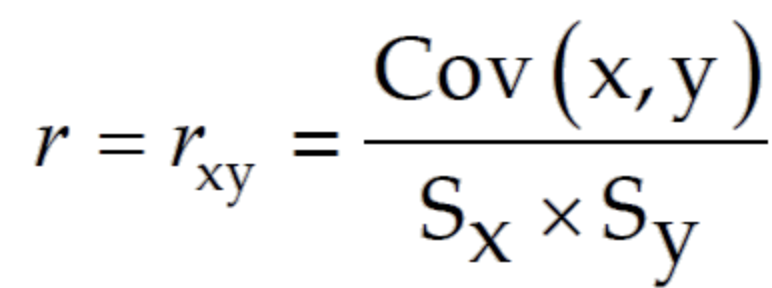
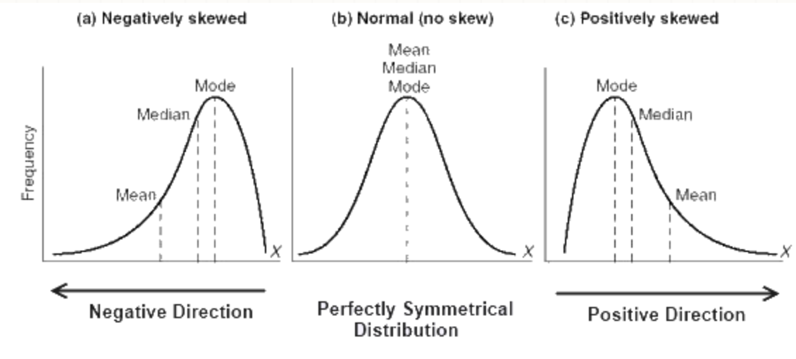
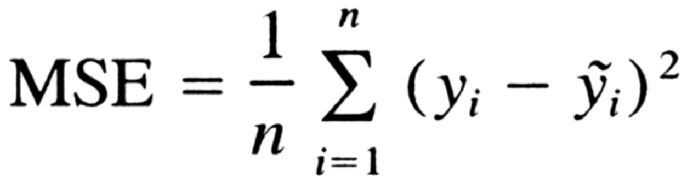

# Titanic Feedback

## 2019/10/02 Tue

## About Features

- [x]  ***Fare Feature***

    0인 애들이 대부분임. 운임이 무료 였을까 과연? Null 이 아닐까?

- [x]  **중요한 Feature 를 찾았을 때.**

    그것을 묶은 상태로 다른 Feature들을 관찰하자.

- [ ]  ***Dimensionality Reduction***

    PCA → Linear한 차원 축소

    t-SNE(Non-Linear) → 군집되어 있다면, 의미를 찾아볼 수 있음

- [x]  ***New Features***

    일반적인 생각을 적용해서 New Feature를 만들어 보는 과정이 필요함.

    예를 들어, Parch가 1보다 크고 + age가 10보다 작으면 1, 아니면 0 이런식으로 해서 Column 추가

    Why? 보호자 있는 애기 들은 더 많이 살았을 수 있으니깐.

    상상력을 활용하자. 상식이 통할 수 있다.

- [x]  ***Correlation***

    

    Correlation은 Continuous Value를 전제로 한다.현재 0과 1의 Categorical 데이터 이기 때문에 굳이 Correlation을 계산해서 의미가 있어도 감을 잡을 순 있지만.

    그것을 어떤 *'객관적 근거'*로서 활용하기 에는 무리가 있다.

- [x]  ***Null Value → Age, Embarked***

    Null을 채워야 하는 Column의 분포를 본다.

    

    보다 일반적인 값으로 Null Space를 채워야 했다면,

    Skewed에 따라 Mode와 가까운 값으로 채우는 것이 합리적 이지.

## Model

- ***Which Model?***

    지금 타이타닉 데이터를 보면, 조건에 따라 달라짐 → 성별에 따라, Pclass에 따라 등등.

    이런 경우는 Linear, Polynomial 모델보다는 아니라 Decision Tree가 떠올랐어야 함.

    ⇒ 그게 아니라면 Linear, Polynomial 을 생각해 봤야겠지.

## Validation

- [x]  ***Mean Squared Error***

    MSE는 Real Value(Yi )와 Prediction(Y hat)의 차이의 제곱의 평균그러면 지금 Real Value가 0 혹은 1인 Categorical 데이터에서 MSE = 0.44가 나왔다면 틀린게 100개중 44개 있다는 말이지.그런데 굳이 이렇게 할 필요가 없잖아? Cross-Validation으로 Validate 해보되 Accuracy로 쓰자.

- [x]  ***Ground-Truth***

    예를 들어, 전체 데이터를 다 죽었다고 예측하고 Accuracy를 구했을 때 60%가 나왔다면?

    내 모델이 최소한 그거 보다는 높아야 의미가 있음.

    반대도 마찬가지.

- ***When tuning HyperParameter***

    1, 10, 100 이런식으로 넓은 범위의 값들을 먼저 대입 → 값을 돌리고 차이를 살핀다.

    그래프가 어떻게 나오는지 보고, Skewed된 그래프 쪽으로 점차 값을 줄여 간다.

    한번에 500개씩 넣고 할 필요가 없음. 범위를 점점 좁히는 작업.

    - [x]  *Random Search CV 찾아보기!*
